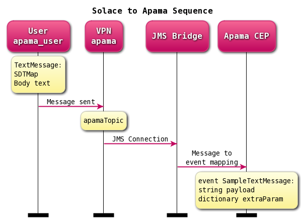

# apama-solace-sample
Sample Apama project and Java project to demostrator JMS connection from Solace to Apama using Apama's Correlator-Integrated Messaging for JMS.



A Solace JCSMP Java project is created to publish direct messages to a topic 'apamaTopic' on Solace VMR.

An Apama project with JMS bundle is created to receive messages from Solace VMR.

An Apama project is created using Software AG Designer. 


```java
SDTMap map = prod.createMap();
map.putString("MESSAGE_TYPE", "com.solace.sample.SampleTextMessage");
TextMessage msg = JCSMPFactory.onlyInstance().createMessage(TextMessage.class);
for (int msgsSent = 0; msgsSent < 1000000; ++msgsSent) {
	//release all memory associated with a message buffer so that the 
	//message buffer is reset to its original state 
	//(that is, as if it has just been allocated). 
	//All fields are reset to their default values
	msg.reset();

	msg.setText("msg count is " + String.format("%05d", msgsSent));
	msg.setDeliveryMode(DeliveryMode.DIRECT);
	msg.setApplicationMessageId("appID-" + msgsSent);
	msg.setElidingEligible(true);
	map.putLong("MESSAGE_CREATED", System.currentTimeMillis());

	msg.setProperties(map);
	prod.send(msg, topic);
	Thread.sleep(500);
}
```

```properties
connectionFactory.jndiName.solace=/jms/cf/apama
jndiContext.environment.solace=java.naming.factory.initial\=com.solacesystems.jndi.SolJNDIInitialContextFactory\njava.naming.provider.url\=${jndiContext.environment.provider.url.solace}\n
jndiContext.environment.provider.url.solace=smf\://192.168.4.167
jndiContext.jndiAuthentication.username.solace=apama_user@apama
jndiContext.jndiAuthentication.password.solace=
connectionAuthentication.username.solace=
connectionAuthentication.password.solace=
clientId.solace=
staticReceiverList.solace=topic\:apamaTopic;
defaultReceiverReliability.solace=BEST_EFFORT
defaultSenderReliability.solace=BEST_EFFORT
JMSProviderInstallDir.solace=C\:/tools/SoftwareAG/common/lib
classpath.solace=${JMSProviderInstallDir.solace}/sol-common-7.2.2.100.jar;${JMSProviderInstallDir.solace}/sol-jcsmp-7.2.2.100.jar;${JMSProviderInstallDir.solace}/sol-jms-7.2.2.100.jar
```

```go
event SampleTextMessage {
	string payload;
	dictionary<string, string> extraParam;
}
```

```go
monitor SampleTopicReceiver {
	action getSolaceMessage() {
		on AppStarted() {
			JMS.onApplicationInitialized();
		}
	}
	action onload () {
		getSolaceMessage();
		on JMSReceiverStatus() as receiverStatus
		{
			log "Received receiverStatus from JMS: " + receiverStatus.toString() at INFO;
			on all SampleTextMessage() as sampleTextMessage {
				log "From JMS: " + sampleTextMessage.toString() at INFO;
			}
		}
		route AppStarted();
	}
}
```

```xml
<bean id="globalReceiverSettings" class="com.apama.correlator.jms.config.JmsReceiverSettings">
		
  <property name="receiverFlowControl" value="false"/>

  <!-- These logging options are for testing/diagnostics only and should 
    not be enabled in a production system due to the possible 
    performance impact 
  -->
  <property name="logJmsMessages" value="false"/>
  <property name="logJmsMessageBodies" value="true"/>
  <property name="logProductMessages" value="false"/>

  <property name="logPerformanceBreakdown" value="true"/>
  <property name="logDetailedStatus" value="false"/>
</bean>
```
